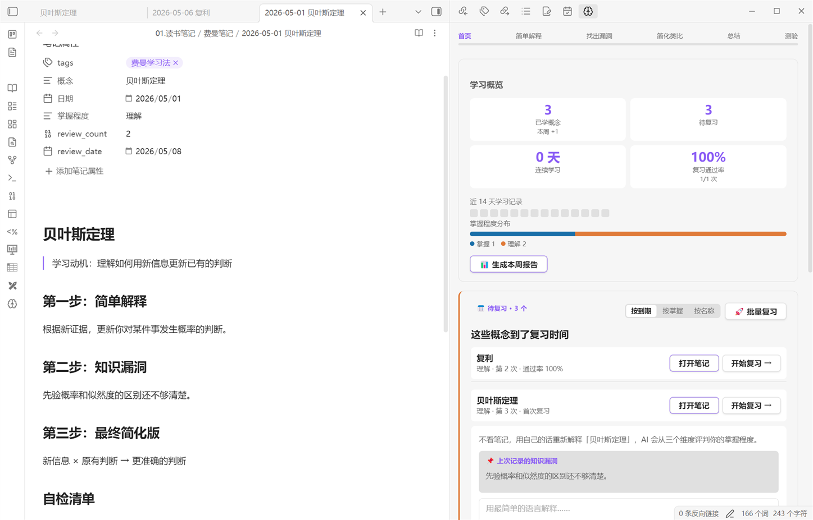
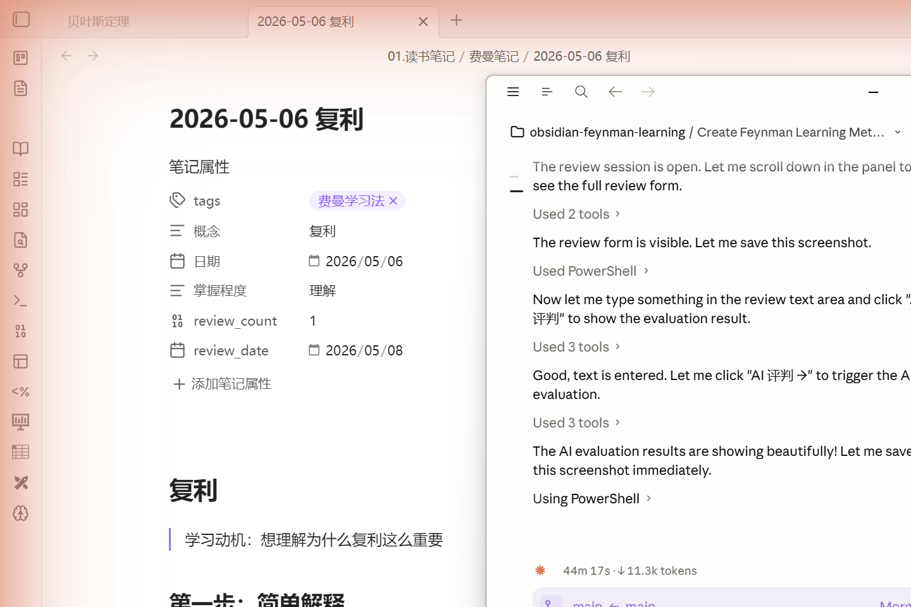
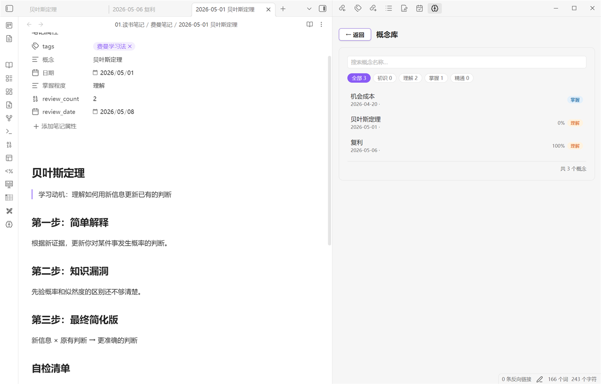

# Feynman Learning — Obsidian Plugin

Learn anything deeply using the **Feynman Technique**: explain it simply, find the gaps, and fill them. This plugin guides you through the full four-step cycle inside Obsidian, with AI assistance powered by any OpenAI-compatible API (DeepSeek, GPT-4o, Claude, local models via Ollama, etc.).

## Screenshots

**Dashboard** — stats, activity heatmap, mastery distribution, and due review queue with sort & batch controls:



**AI evaluation** — 3-dimension scoring (语言简洁 / 核心机制 / 举例说明) with pass/fail, explanatory feedback, and one-click weak-point drill:



**Concept browser** — search and filter all your Feynman notes by mastery level:



## Features

### Learning workflow
- **4-step guided workflow** — Select concept → Explain simply → Identify gaps → Simplify & analogize
- **AI tutor** — Follow-up questioning, gap analysis, and gap-coverage verification before you advance
- **Text extraction + learning queue** — Paste an article; AI extracts 3–8 concepts. Add any or all to a queue and work through them in order from the dashboard
- **Filename preview** — Edit the save filename before writing to vault (Step 4)
- **AI quiz** — Generate and answer questions on your explanation; receive per-question feedback
- **Concept connections** — AI finds related concepts from your library and optionally adds wiki-links to notes
- **Learning recommendations** — After saving, AI suggests 3 concepts worth learning next

### Spaced repetition review
- **Configurable intervals** — Customize the three review intervals (default: 1 / 7 / 30 days) in Settings
- **Three quality tiers** — Each review is scored by AI on three dimensions:
  - All ✓ ("很熟练") → interval × 1.3 (longer)
  - Any △ (partial) → interval × 0.6 (shorter)
  - Fail → retry the next day
- **3-dimension AI judgment** — Scored on 语言简洁 / 核心机制 / 举例说明 (✓ △ ✗)
- **Weak-point drill** — After a failed or partial review, click 🎯 to get AI-generated targeted questions for the exact weak dimensions, with per-question feedback
- **Weak-point tracking** — Failed review dimensions are saved to the note and shown on the next review session
- **Review sorting** — Sort due concepts by due date (most overdue first), mastery level, or name
- **Batch review** — Review all due concepts in sequence with a progress bar; supports skip and exit
- **"Review current note" command** — Trigger a review session directly from a due feynman note via the command palette

### Mastery & analytics
- **Four mastery levels** — 初识 → 理解 → 掌握 → 精通, advanced only on AI-evaluated pass
- **Review pass rate** — Per-concept and overall historical pass rate in the dashboard and concept browser
- **Dashboard** — Streak, total concepts, due count, mastery distribution bar, activity heatmap, weekly report
- **Concept browser** — Search and filter by mastery level with pass rates at a glance
- **Weekly report** — AI-written summary of the week: new concepts, reviews, pass rate, streak

### Integrations
- **Notion sync** — Push each completed learning session to a Notion database
- **Auto-save notes** — Every session is saved as a Markdown note with YAML frontmatter

## Installation

### Option A — BRAT (beta, recommended for now)

1. Install the [BRAT plugin](https://github.com/TfTHacker/obsidian42-brat) from Obsidian's Community Plugins
2. Open **Settings → BRAT → Add Beta Plugin**
3. Enter the repository: `jialingxiao/obsidian-feynman-learning`
4. Enable **Feynman Learning** in **Settings → Community Plugins**

### Option B — Manual

1. Download `main.js`, `manifest.json`, and `styles.css` from the [latest release](https://github.com/jialingxiao/obsidian-feynman-learning/releases/latest)
2. Create the folder `.obsidian/plugins/feynman-learning/` inside your vault
3. Copy the three files into that folder
4. Enable **Feynman Learning** in **Settings → Community Plugins**

### Option C — Community Plugin browser

Search for **Feynman Learning** in **Settings → Community Plugins → Browse**.

## Setup

1. Open **Settings → Feynman Learning** and configure:

   | Setting | Description | Default |
   |---------|-------------|---------|
   | **API Key** | Your API key | *(required)* |
   | **API Base URL** | Endpoint URL | `https://api.deepseek.com/v1` |
   | **Model name** | Model to use | `deepseek-chat` |
   | **Temperature** | Response creativity, 0–1 | `0.8` |
   | **Review intervals** | Days for each review stage | `1 / 7 / 30` |
   | **Notes folder** | Where learning notes are saved | `费曼笔记` |
   | **Index file** | Path to your concept index note | *(optional)* |
   | **Notion Token** | Notion integration secret | *(optional)* |
   | **Notion Database ID** | Target Notion database | *(optional)* |

2. Click **Test Connection** to verify your API key works.

## Supported APIs

The plugin works with any service that implements the OpenAI Chat Completions API (`/v1/chat/completions`):

| Service | API Base URL | Model example |
|---------|-------------|---------------|
| DeepSeek *(default)* | `https://api.deepseek.com/v1` | `deepseek-chat` |
| OpenAI | `https://api.openai.com/v1` | `gpt-4o` |
| Anthropic (via proxy) | your proxy URL | `claude-opus-4-5` |
| Ollama (local) | `http://localhost:11434/v1` | `llama3` |
| Any compatible service | your endpoint | your model name |

## Usage

Click the brain icon (🧠) in the left ribbon to open the Feynman Learning panel.

### Learning a new concept

1. **Step 1 — Select**: Enter the concept name and why you want to learn it. Or click **📄 从原文提取概念** to paste an article and let AI suggest concepts.
2. **Step 2 — Explain**: Write your explanation as if teaching a 12-year-old. The AI will ask follow-up questions to probe your understanding.
3. **Step 3 — Gaps**: The AI identifies weak spots; you fill them in. AI verifies your final explanation covers each gap before you advance.
4. **Step 4 — Simplify**: Refine your explanation and create an analogy. Optionally take an AI quiz or discover concept connections.
5. **Done** — Edit the filename if needed, then save. The note is opened automatically.

### Reviewing concepts

Due concepts appear in the **Review** section of the dashboard. Sort them by due date, mastery level, or name using the tabs at the top of the section.

- Click **开始复习 →** on any item to write your re-explanation and get AI scoring.
- Click **🚀 批量复习** to cycle through all due concepts in sequence.
- Use the command palette and search **"复习当前费曼笔记"** when a due note is open.

Review intervals adjust dynamically based on AI scoring:

| Result | Next interval |
|--------|--------------|
| All ✓ (很熟练) | base × 1.3 (longer) |
| Any △ (partial pass) | base × 0.6 (shorter) |
| Fail | 1 day (retry) |

Clicking **🎯 专项练习 / 🎯 强化弱点** opens an inline drill: the AI generates 2–3 targeted questions for the specific weak or partial dimensions. Submit answers for per-question feedback, or retry as many times as needed.

### Weekly report

Click **📊 生成本周报告** in the dashboard to generate a Markdown summary of the week: concepts learned, reviews completed, pass rate, streak, and an AI-written reflection.

## Note format

Each session creates a Markdown file with YAML frontmatter:

```yaml
---
tags: [费曼学习法]
概念: "Newton's Laws"
日期: "2025-01-01"
掌握程度: "理解"
review_date: "2025-01-08"
review_count: 1
---
```

Failed reviews append a `## 复习记录` section with dimension scores and evaluation so subsequent sessions have a clear target.

## Development

```bash
# Install dependencies
npm install

# Build (watch mode)
npm run dev

# Production build
npm run build

# Run tests
npm test

# Bump version (updates package.json, manifest.json, versions.json)
npm run bump 1.2.0
```

Tests live in `src/__tests__/` and cover all pure utility functions (no Obsidian dependency).

## Privacy

- Your API key is stored locally in Obsidian's plugin data file
- No telemetry or analytics of any kind
- The only external requests are to your configured API endpoint (and optionally Notion)

## License

MIT © Xiaoxiaoqi
